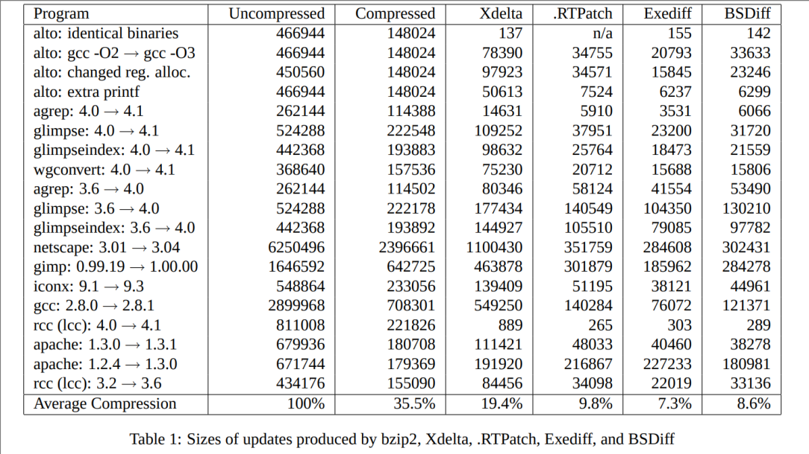

## 可执行代码的差异
copy from http://www.daemonology.net/blog/

### 摘要

发现严重安全缺陷的频率越来越高，利用这些缺陷的速度也越来越快，因此程序更新的频率比过去要高得多。虽然二元更新通常比源代码更新方便得多，但指点在整个可执行文件中的分布使得制作紧凑的修补程序更加困难。

与早期依赖知识的工作相比， 对于特定平台可执行文件的内部结构，我们描述了一种 naé éve 方法，它为任何可执行文件生成具有竞争力的小补丁。

### 介绍

从历史上看，二进制补丁是使用两个基本操作，复制(Copy)和插入(Insert)。使用子串匹配(substring matching)或哈希技术(hashing techniques) [Ma00]，新文件的一部分与旧文件的部分匹配：这些区域被复制，而剩余的"新"字节存储在修补程序文件中并插入。因此，以这种方式生成的修补程序可以被视为由两个指令组成的程序， 复制(Copy)和插入(Insert)。

遗憾的是，任何源代码修改通常会导致整个可执行文件的更改。添加或删除少量代码或数据将更改代码块的相对位置，调整跳过修改区域的相对分支的位移：同样，
修改后的区域后的任何数据都将具有不同的地址，导致数据指点(data pointers)在整个文件中进行修改。这会导致使用传统复制和插入方法生成的修补程序比
必要的要大得多：500kB可执行的单行源代码修补程序可以转换为50kB修补程序文件。

这个问题的一个解决方案依赖于对可执行文件内部结构的了解。如果在旧的可执行文件中处理 A 的指点(a pointer to address A)更改为指向新可执行文件中
的地址 B(point at address B)，则处理 A 的其他指头(other pointers to address A)很可能也会以同样的方式更改。因此，通过有效地拆解整个文件
并记录每个此类替换的初例(first instance)，可以预测未来的替换(substitution)，从而无需记录它们 [BMM99]。但是，必要的拆解意味着使用此方法的
任何工具将完全依赖平台。

### BSDiff

为了便携式地解决"指点问题"，我们提出了两个重要意见：第一，在不受修改直接影响的可执行文件区域，差异一般会相当稀疏。修改后的地址不仅只占编译代码
的一小部分，而且地址很可能只更改其最不重要的一个或两个字节。其次，数据和代码往往在块中移动：因此，参考地将导致大量不同的（附近）地址按相同数量
进行调整。这两个观察结果导致一个重要事实，即如果对应于相同源代码行的可执行程序的两个版本中的区域相互匹配，则字节差异(byte difference)将大部分
为零，即使非零将比其他区域更频繁地获取某些值 - 简而言之，字符串字节差异(string of bytewise differences)将高度可压缩。

我们现在构建如下二进制修补程序。首先，我们阅读旧文件并执行某种索引，无论是基于哈希(hashing)[Tr99] 或后缀排序(suffix sorting)（例如 [LS99]）。
接下来，使用此索引，我们通过新文件，找到一组与旧文件区域完全匹配的区域。由于以后会明显的原因，我们只记录包含至少8字节的区域，这8字节区域与上一次
匹配向前扩展(forward-extension)不匹配(例如：如果上一次的匹配是 new[x...x+k] = old[y...y+k], 我们寻找一个匹配 new[x1....x1+k1] = 
old[y1...y1+k], 至少有8个不同的我这样的 new[x1 + i] <> old[x1 + i + (y-x)])。

传统的二进制修补程序(binary patch tools)将直接将这组完美的匹配转换为补丁程序文件。相反，我们通过将匹配扩展到每个方向来生成一组对联的
"近似匹配"("approximate matches")，但需遵守向前扩展的每个后缀(suffix of the forward-extension)（以及向后扩展的每个前缀:
prefix of the backwards）至少在其字节(bytes)的 50% 中匹配的要求。这些近似匹配(approximate matches)现在将大致对应源代码未修改区域
(unmodified regions)的可执行代码块(executable code)，而新文件的区域不属于近似匹配项，大致对应修改后的源代码行。此扩展匹配的过程是
我们忽略任何,不比上一场匹配"更好"的匹配，以8字节(8 bytes)。

然后，修补程序文件由三个部分组成：第一，包含 ADD 和 INSERT 指令的控制文件(a control file containing ADD and INSERT instructions)：
 第二，"差异"文件(a 'difference' file)，包含近似匹配的逐项差异(bytewise differences of the approximate matches)：
 第三，一个"额外"文件(an 'extra' file)，包含的字节不是近似匹配的一部分。每个 ADD 指令都指定旧文件中的偏移(offset)和一个长度(length)：
 从旧文件读取相应的字节数，并添加到差异文件中的相同字节数。插入指令仅指定长度：从额外的文件中读取指定的字节数。虽然这三个文件在一起比原始目标文件稍大，
控制和差异文件具有高度可压缩性： 特别是，bzip2 往往表现非常出色（可能是由于这两个文件的高度结构化性质）。

我们已经在名为"BSDiff"的工具中实现了此方法。

### 性能 Performance

为了评估 BSDiff 在可执行的两个版本之间移动时的性能，我们使用 19 对 DEC UNIX Alpha 二进制文件用于 Exediff 的阐述，其工作特定于
该平台 [BMM99]。在表 1 中，我们列出了新版本的原始尺寸、新版本的压缩尺寸、当前卓越的免费二进制修补工具 Xdelta [Ma00]制作的补丁大小。
RTPatch [Ps01]， Exediff 制作的补丁的大小， 以及 Bsdiff 制作的补丁的大小。为了公平比较，我们用 
bzip2(块排序压缩机:block sorting compressor) 而不是 gzip(a Lempel-Zif compressor)重新压缩了 Exediff 的补丁，因为它更优越。

除了两种情况，差异特别小， Apache 1.2.4 → 1.3.0 的情况下， 没有一种方法优于简单地压缩(simply compressing)新的二进制📃文件， 
在 Apache 1.3.0 → 1.3.1 的情况下， 其中 BSDiff 略优于(slightly superior) Exediff， 有一个非常明确的模式： XDelta 给出最大的
补丁(patches)， Exediff 给出最小的补丁(patches)，而 BSDiff 和 RTPatch 补丁分别排在第二小和第二位。考虑到所有19对，并采取算术平均加权的
原文件大小的平方根，我们发现，bzip2 压缩了 2.8 倍，XDelta 压缩了 5.2 倍，。RTPatch 压缩了 10.2 倍，Exediff 压缩了 13.7 倍，
BSDiff 平均提供 11.6 倍压缩。不包括 Apache 1.2.4→1.3.0 升级（我们注意到，这两个版本共享不到一半的源代码，所以大补丁并不奇怪），XDelta 
给出平均5.3倍的压缩，。RTPatch 平均提供 11.6 倍压缩，Exediff 提供 16.8 倍压缩，BSDiff 提供 13.0 倍压缩。

然而，比上述在版本之间升级（"功能更新"）的考虑更重要的是安全更新。这些是根本不同的，因为源代码修改通常是非常小的-通常小如单行。我们将
Free BSD 4.7-发布的i386版本和 RELENG 4 7 安全分支的快照作为此处进行比较的语料库。总共有97个修改后的二进制文件，总大小为36397575字节，
bzip2 可以压缩到13566233（2.7倍）。Xdelta 生产补丁总计 3288540 字节（11.0 倍）， RTPatch 生产的补丁总计 749710 字节（47.7 倍），
而 BSDiff 生产的补丁总计 621277 字节，减少了 58.3 倍。

### 结论 Conclusions

我们提出了生成二进制的算法适用于可执行程序的两个版本的修补程序，始终生成的补丁比当前卓越的二进制修补程序生成的补丁要小得多：当应用于安全更新时，生成的修补程序非常紧凑。虽然其性能与平台专用工具的性能并不完全匹配，但我们相信，BSDiff 可能通过平台独立工具获得接近最佳性能。

### 感谢

作者衷心感谢罗伯特·穆斯用于搜索四年前的备份，以查找 [BMM99] 中使用的语料库。

作者还要感谢来自联邦奖学金委员会，资助他在牛津大学的学习。

### 可用性

BSDiff 可根据开源许可证从 http://www.daemonology.net/bsdiff/。 用于上述性能比较的文件可应作者的要求获得。

### 引用

[BMM99] B.S. Baker, U. Manber, and R. Muth, Compressing Differences of Executable Code, ACM SIGPLAN Workshop on Compiler Support for System Software, 1999.

[LS99] N.S. Larsson, K. Sadakane, Faster Suffix Sorting, LU-CS-TR:99-214, Department of Computer Science, Lund University, 1999.

[Ma00] J.P. MacDonald, File System Support for Delta Compression, Master’s Thesis, University of California at Berkeley, 2000.

[Ps01] Pocket Soft Inc, .RTPatch, http://www.pocketsoft.com, 2001.

[Tr99] A. Tridgell, Efficient Algorithms for Sorting and Synchronization, Ph.D. Thesis, The Australian National University, 1999.

