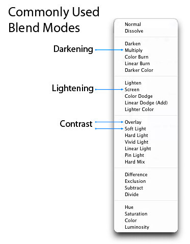

## photoshop混合模式介绍
使用混合模式(blend mode)几乎总是一个实验过程。由于几乎不可能预测结果，因此您似乎总是会尝试使用不同的模式和“填充不透明度”(Fill Opacities)，直到获得所需的结果。

在本文中，我将为您提供各种混合模式的功能的更深入的认识，然后，我将通过解释所涉及的一些数学方法及其相互关系，来更深入地研究混合模式的基本要素。彼此。我不会向您“展示”混合模式的工作方式，而是要“解释”它们的工作方式。在阅读完本文时，您应该对如何使用混合模式以及从何处开始“实验”有了一个更好的了解，这反过来又可以减少获得所需结果所需的时间。

### 混合模式如何工作 How Blend Modes Work

“图层”面板中的“不透明度”滑块(Opacity slider)使您可以通过使活动层半透明(active layer translucent)来混合活动层和下面的层，从而使下面的层得以显示。在Photoshop中找到的混合模式允许进行相同的过程，但是对每个混合模式使用不同的数学计算。从Photoshop CS5开始，共有27种混合模式-最近添加了2种新的混合模式，“减”(Subtract)和“除”(Divide)。使用混合模式所做的任何更改都是参数性的(parametric)，即，这些更改是非破坏性的，您始终可以重新访问混合模式设置并根据需要重新调整它们，而不会损坏原始图像中的像素。

### 混合模式组 Blend Mode Groups

尽管混合模式名称没有多大意义，但Adobe确实将混合模式分组为逻辑组。

### 常用的混合模式 Commonly Used Blend Modes

一些更常用的混合模式是 Multiply, Screen, Overlay and Soft Light.

### 混合模式相反 Blend Mode Opposites

“变暗”组中的每个混合模式在“变亮”组中具有相反的（互补）模式。这些“对立”使用略有不同的数学来得出结果，但是它们使用的逻辑相似但相反。例如，在“变暗”混合模式下，如果活动层上的像素比下面层上的像素暗，则它们将保留在图像中。与“变暗”相反的混合模式是“变亮”，而在“变亮”混合模式下，如果活动层上的像素比下面层上的像素更亮，它们将保留在图像中。

### 通勤混合模式 Commuted Blend Modes 

有2对混合模式，它们是彼此换向的版本。第一个换向对是“覆盖”(Overlay)和“强光”(Light)模式。第二对是“发光度”(Luminosity)和“颜色”(Color)模式。当两种混合模式是彼此转换的版本时，如果将一种混合模式应用于活动图层(active layer)，则将另一种（转换的）(commuted)混合模式添加到下面的层(underling layer)，然后颠倒顺序，可以得到所有层相同的结果。

### “8种特殊”混合模式

我将8种混合模式称为“8种特殊”。与调整标准不透明度相比，调整“填充不透明度”(Fill Opacity)时，这些混合模式的行为有所不同。不是该特殊8组成员的混合模式对填充和不透明度更改（如果没有“图层效果”）的反应相同，但是对于这些特殊8混合模式，40％不透明(40% Opacity)看上去与40％填充(40% Fill)不同，或30％不透明度(30% Opacity)看上去与30％填充(30% Fill)不同，依此类推。对于所有其他混合模式（不属于Special 8模式的模式）），“ 40％不透明度”(40% Opacity)看起来与“ 40％填充”(40% Fill)相同，或者“ 20％不透明度”(20% Opacity)看起来与“ 20％填充”(20% Fill)相同，依此类推。这是一个很重要的概念，因为它可以扩展这些混合模式的功能。例如，“硬混合”混合模式(Hard Mix blend mode)通常看起来并不那么好，但是当您为该模式调整“填充不透明度”时(adjust the fill Opacity for this mode)，您可以获得一些出色的结果。属于“特殊8”组的混合模式是“颜色加深”(Color Burn)，“线性加深”(Linear Burn)，“颜色减淡”(Color Doge)，“线性减淡（添加）”(Linear Doge(add))，“鲜艳光”(Vivid Light)，“线性加光”(Linear light)，“硬混合”(Hard Mix)和“差异”(Difference)。

### 混合模式数学 Blend Mode Math

在列出27种混合模式及其工作方式之前，您需要了解 Photoshop 中的数学如何工作。由于混合模式适用于亮度(brightness)和暗度(darkness)值（即亮度级别 luminance levels），并且由于亮度级别(luminance levels)在 Photoshop 中显示为0到255之间的值（如从“级别”对话框中看到的），因此您可以假定 Photoshop 执行的数学基于这些值。但是，在后台，Photoshop 在应用数学运算之前先“标准化”这些亮度值。将这些值标准化后，白色（255）变为1，黑色（0）保持为0，而50％的灰色变为0.5。所有混合模式数学都发生在0到1之间的小范围内。理解此标准化概念很重要，因此您可以了解以下数学方程式。

由于在应用数学运算之前，亮度值已经标准化，并且数学运算的数字范围为0到1，因此所得的计算结果可能与您的预期不符。例如，当使用大于1的数字时，除法运算将得出较小的数字，而乘法运算将得出较大的数字。但是，使用0到1之间的数字时，除法运算会得出较大的数字，而乘法运算会得出较小的数字。无论您使用的是大于1的数字还是0到1之间的值，减法和加法的工作原理都与预期的差不多。

下面是一些使用任意数字的示例，这些示例显示了使用0到1之间的数字与0到255之间的数字时数学结果的差异。为帮助您更好地理解下面所示的数值，常规亮度数字200转换为标准数值使用：200÷255 = 0.78，并且常规数字72通过使用：72÷255 = 0.28转换为标准数字。

#### Divide Example

Background layer ÷ Active layer = Quotient
常规亮度数字：	200÷72 = 2.78	变暗的效果
标准化亮度数字：	0.78÷0.28 = 2.78	吹净白色的增亮效果

#### Multiply Example

Background layer × Active layer = Product
常规亮度数字：	200×72 = 14,400	美白效果极佳的增亮效果
标准化亮度数字：	0.78×0.28 = 0.22	变暗的效果

#### Addition Example

Background layer + Active layer = Sum  
常规亮度数字：	200 + 72 = 272	亮白的妆容，有增白效果。
标准化亮度数字：	0.78 + 0.28 = 1.06	亮白的妆容，有增白效果。

####  Subtraction Example

Background layer − Active layer = Difference
常规亮度数字：	200-72 = 128	变暗效果和中间色调（50％）灰色
标准化亮度数字：	0.78-0.28 = 0.5	变暗效果和中间色调（50％）灰色

### Blend Mode Math Examples 混合模式数学示例

A = Active Layer
B = Background Layer (i.e., the underlying layers)
*In the equations below, 1−X = the luminance level “X” is Inverted

#### Darken Modes Math

|Blend Mode | Equation | Description |
|-----------|----------|-------------|
| Multiply  | A X B    | A multiply B |
| Color Burn | 1-(1-B)÷A | B inverted divided By A , and the quotient is then inverted |
| Linear Burn | A + B - 1 | A plus B, then white is subtracted from the sum (an inversion) |

#### Lighten Modes Math

|Blend Mode | Equation | Description |
|-----------|----------|-------------|
| Screen | 1-(1-A)X(1-B)| A inverted multiply by B inverted, and the product is inverted|
| Color Doge | B÷(1-A) | B divided by A inverted |
| Linear Dodge | A+B | A plus B |

#### Cancellation Modes Math

|Blend Mode | Equation | Description |
|-----------|----------|-------------|
| Subtract  |  B−A | B minus A |
| Divide | B÷A	 | B divided by A |

### Blend Mode Descriptions

#### 普通组 normal group

|Blend Mode | Description |
|-----------|-------------|
| Normal(普通)	| 没有应用数学运算的普通模式。|
| Dissolve(溶解) | 溶解混合模式 (Dissolve blend mode)对透明(transparent)和部分透明(partially transparent)的像素(pixels)起作用-将透明视为像素图案，并应用扩散抖动图案(diffusion dither pattern)。|

#### 变暗组 DARKEN GROUP

|Blend Mode | Description |
|-----------|-------------|
| Darken(变暗) |如果所选图层的像素(pixels)比下面图层的像素暗(darken)，它们将保留在图像中。如果该层中的像素(pixels)较亮(lighter)，则将它们替换为下面各层上的色调(tones)（它们一直显示到所选层），因此基本上所有层都保留了较暗的色调(darken tones)。请注意，此行为基于逐个通道，即，此规则分别应用于3个 RGB 颜色通道中的每个。如果要在复合基础上应用相同的“加深”混合模式(Darken blend mode)行为，请改用“较深的颜色”混合模式(Darker Color blend mode)（但是，这通常会导致更苛刻的过渡）。  |
| Multiply(乘法) | 最佳变暗模式。通过将当前层像素(current layer's pixels)的亮度级别(luminance level)乘以下一层中的像素来工作。非常适合创建阴影(create shadows)并消除白色和其他浅色（同时保持较深的颜色）。打个比方，可以将选定的图层和下面的所有图层视为单独的幻灯片，并将它们堆叠在一起，然后放在高架投影仪上。使用这种类比，穿过较亮区域的光将难以穿过较暗区域，但是较亮区域将相对容易地穿过其他较亮区域发光。如果“乘以混合”模式(Multiply blend mode)不足以适应您的工作，请尝试“线性加深”(Linear Burn mode)或“彩色加深”模式(Color Burn mode)。数学：A×B （活动层乘以背景层）。 |
| Color Burn(special 8) (颜色加深)| 比“乘法”更暗(darker)，具有更高的饱和中间色调(highly saturated mid-tones)和减少的高光(reduced highlights)。这是我前面提到的“8种特殊”之一，其中“填充”(Fill)和“不透明度”(Opacity)的行为有所不同。数学：1-（1-B）÷A（背景层被反转，除以活动层，然后商被反转）。 |
|Linear Burn (Special 8) | 比“Multiply”要深，但不比“Color Burn”更饱和。这是我前面提到的“特殊8”之一，其中“填充”和“不透明度”的行为有所不同。数学：A + B-1（活动层加上背景层，然后从总和中减去白色（反转）。 |
| Darker Color | 类似于“Darken blend”模式，但在复合通道(composite channel)上变暗(darken)，而不是在单独的RGB颜色通道(separate RGB color channels)上变暗(darken)。 |

#### 变量组 LIGHTEN GROUP

|Blend Mode | Description |
|-----------|-------------|
| Lighten(变亮) | 如果所选层的像素比下面的层的像素浅，则它们将保留在图像中（与“变暗”混合模式相反）。如果图层中的像素较暗，则将它们替换为下面图层中的像素（它们会显示到所选图层）。请注意，此行为基于逐个通道，即，此规则分别应用于3个RGB颜色通道中的每个。如果要在复合基础上应用相同的“浅化”混合模式行为，请改用“浅色”混合模式（但是，这通常会导致更苛刻的过渡）。 |
| Screen(屏幕) | 与减亮混合模式(Lighten blend mode)相似，但更亮(brighter)并删除了更多的暗像素(dark pixels)，从而使过渡更加平滑(in smoother transitions)。它的工作原理与乘法混合模式(Multiply blend mode)类似，因为它会乘以亮像素(light pixels)（而不是像乘法混合模式那样是暗像素(dark pixels)）。打个比方，假设所选层和每个基础层都是35毫米幻灯片，并且每个幻灯片都放置在单独的投影仪中（每个投影仪一个幻灯片），然后打开所有投影仪并指向同一台投影仪屏幕。这就是是屏幕混合模式(screen blend mode)的效果。这是使黑色消失而保持白色并产生发光效果的绝佳模式。数学：1-（1-A）×（1-B）（A倒数乘以B倒数，并且乘积倒数）。 |
| Color Dodge (Special 8) | 比屏幕混合模式(Screen blend mode)更亮。产生强烈的对比色，通常会导致饱和的中间色调(saturated mid-tones)和高光斑点( blown highlights)。数学：B÷（1-A）（B除以A取反）。 |
| Linear Dodge (Add) (Special 8) |比 "Color Dodge" 混合模式更亮，但饱和度(saturated)和强度(intense)更低。此模式“增加”亮度等级(add the luminance levels)。数学：A + B（A加B）。 |
| Lighter Color	 | 与减亮混合模式(Lighten blend mode)相似，但在复合通道(composite channel)上变亮，而不是在单独的颜色通道上变亮。比较每个像素，使用两者中的更亮的像素(通常会导致更困难的过渡)。 |

#### 对比度组 CONTRAST GROUP

|Blend Mode | Description |
|-----------|-------------|
| General Notes (一般说明)	| 所有对比度模式(contrast mode)的工作方式是将最亮的像素变得更亮，使最暗的像素更暗，并丢弃灰色的中色调（50% 灰色）(dropping the gray mid-tones(50% gray))。这是通过使用变量(lightening)和变暗(darkening)组的增亮(lightening mode)和变暗模式(darkening mode)的组合来实现的。对比混合模式的工作方式是检查颜色是否比中灰色暗(darker than medium gray)，还是比中灰色浅(lighter than medium gray)。如果它们比中灰色暗(darker than medium gray)，则应用变暗的混合模式(darkening blend mode)。相反，如果颜色比中灰色亮(brighter than medium gray)，则应用增亮模式(brightening mode)。中点(mid-point)（50%灰色）被丢弃。对于每个对比混合模式，数学应用于互补（相反）混合模式。例如，叠加混合模式(Overlay blend mode)使用倍增模式(Multiply blend mode)和屏幕混合模式(Screen blend mode)的组合，这些模式是相互补充的。其他互补混合模式是：变暗(Darken)/变亮(Lighten)、颜色加深(Color burn)/颜色变淡(Color Dodge)、线性加深(Linear Burn)/线性变淡(Linear Dodge)（添加）、深色(Darker Color)/浅色(Lighter Color)。 |
| Overlay | 在较亮的像素(lighter pixels)上使用屏幕混合模式(Screen blend mode)的组合，在较暗的像素(darker pixels)上使用乘法混合模式(Multiply blend mode)。它使用这些模式的半强度(half-strength)应用，中色调(mid-tones)（50%灰色 50% gray）变得透明(transparent)。叠加混合模式(Overlay blend mode)与其他对比混合模式之间的一个区别是，它根据活动层下层的亮度进行计算，所有其他对比度模式都根据活动层的亮度进行计算。要获得类似于叠加模式的结果，但混合模式(blend mode)偏爱活动层，请使用硬光混合模式(Hard Light blend mode)（它使用类似的逻辑，但偏爱活动层）。关于叠加混合模式(Overlay blend mode)，需要注意的另一件事是，它和硬光混合模式(Hard Light blend mode)是彼此的互补版本。这意味着，如果您将叠加混合模式应用于活动层，则如果将硬光混合模式应用到下面的层，然后切换图层的顺序，您将获得相同的效果。 |
| Soft Light(柔和的光线)  | 在较亮的像素(lighter pixels)上使用屏幕混合模式(Screen blend mode)，在较暗的像素(darker pixels)上使用 Multiply 混合模式(Multiply blend mode)（两种模式的半强度(half-strength)应用）。类似于叠加混合模式(Overlay blend mode)，但会导致更有机的效果，更柔和-导致一些透明的亮点(transparent highlights)和阴影(shadows)。|
| Hard Light(强烈的光线) | 在较轻的像素(lighter pixels)上使用线性减淡混合模式(Linear Dodge blend mode)，在较暗的像素(darker pixels)上使用线性加深混合模式(Linear Burn blend mode)。它使用这些模式的半强度(half-strength)应用，逻辑类似于叠加混合模式(Overlay blend mode)，但偏向于活动层(active layer)，而不是底层(underling layer)。效果比叠加混合模式(Overlay blend mode)更强烈(commuted)，并导致更严酷的光线(harsher light)。关于硬光混合模式(Hard Light model)的另一点需要注意的是，它和叠加混合模式(Overlay blend mode)是彼此的互补版本。这意味着，如果您将硬光混合模式应用于活动层，则如果将叠加混合模式应用到下面的层，然后切换图层的顺序，则将获得相同的效果。 |
| Vivid Light(Special 8) 生动的光（8种特别） | 在较轻的像素(lighter pixels)上使用颜色道奇模式(Color Dodge blend Mode)和在较暗像素(darker pixels)上使用颜色加深混合模式(Color Burn blend mode)（两种模式的半强度(half-strength)应用）的组合。类似于超速的硬混合混合模式(Hard Mix blend mode)，通常会导致更极端的效果。 |
 

